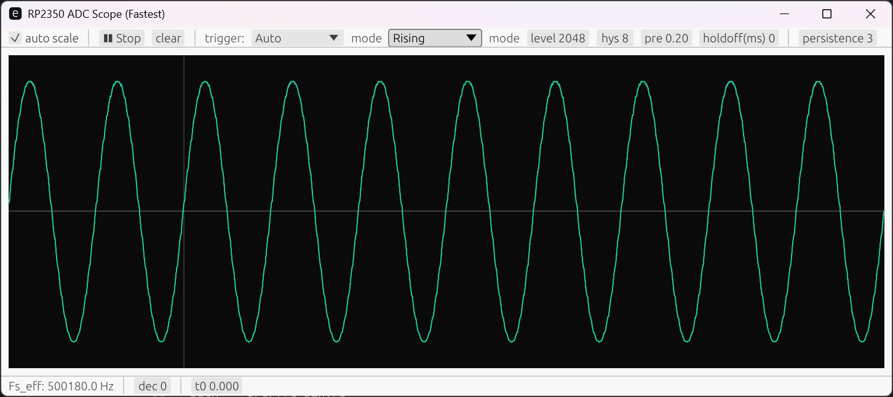
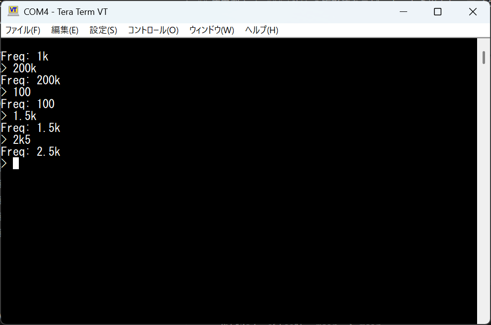
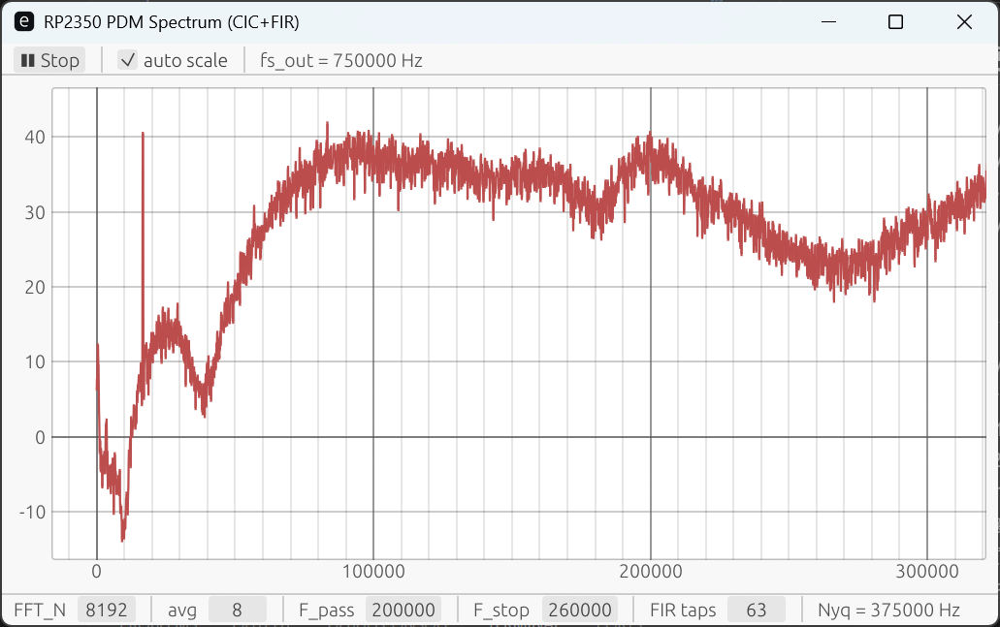

# PicoWaveDock クイックスタートガイド

## 基本的な使い方

1. Raspberry Pi Pico 2（別売り）をソケットにセットする
2. Raspberry Pi Pico 2の **BOOTSELボタン（白いボタン）を押しながら**、USBケーブルでPCに接続する
3. Raspberry Pi Pico 2にコードを書き込む

## 事前準備

- Raspberry Pi Pico 2（別売り）を用意する
- 以下のパーツをはんだ付けする（穴にはまる刺し方であれば、向きは任意）
    - 1x20ピンソケット（2個）
    - 2×10ピンヘッダ
    - 可変抵抗（サイドの固定ピンを少し曲げて調整）
    - スピーカー
- スペーサーを挿入し、ナットで固定する（4か所）

## 操作説明

### スイッチ類

信号は`MOD0`→`LPF0`→`MOD1`→`OUT0`の順に通過。

#### `MOD0`スイッチ

- `PAS`: 何もしない
- `OUT`: `SIG0→`ピンから信号を出力し、`←SIG0`ピンから信号入力を受ける

#### `LPF0`スイッチ

- `PAS`: 何もしない
- `OUT`: 信号をローパスフィルタに通す

#### `MOD1`スイッチ

- `PAS`: 何もしない
- `OUT`: `SIG1→`ピンから信号を出力し、`←SIG1`ピンから信号入力を受ける

#### `OUT0`スイッチ

- `SND`: 信号をスピーカーに出力
- `ADC`: 信号をRaspberry Pi Pico 2の`GPIO28`ピンに入力

### 可変抵抗

ローパスフィルタのカットオフ周波数を変更する。

### 入出力端子

`MOD0`スイッチ・`MOD1`スイッチの入出力端子の他に、Raspberry Pi Pico2の

- VBUS
- VSYS
- GND
- 3V3_EN
- 3V3_OUT
- GPIO27
- GPIO26
- GPIO19
- GPIO18
- GPIO17
- GPIO16

が利用可能。

## ディレクトリの説明

- `open-source-silicon-magazine-vol2`: ISHI会の[「Open Source Silicon Magazine Vol.2 ーマイコンチップを自作しようー」](https://techbookfest.org/product/16QdT05XCLVsRDi1fqX2wy?productVariantID=cNR7b38fA9Ep7S1aKgM5Dy)の記事中で使用した回路図とコード
- `pio-dualcore-book`: [「Rustで学ぶPIOとデュアルコア ーRaspberry Pi Pico 2によるタイミング制御と高速・並列処理ー」](https://techbookfest.org/product/d91HkRw2rxdik7BYVb2BDc?productVariantID=ENVuWDaMN0qXmDj6twDLh)の最終章で使用したサンプルコード
- `wave_example`: 波形生成・計測の各種実装例（Raspberry Pi Pico 2用のRustコード）
- `wave_viewer`: 波形確認用のオシロスコープやスペクトログラムの実装（PC用のRustコード）

## 使用例

事前にRustによる組込み開発環境構築（後述）が必要

### 1kHzの正弦波を出力して、オシロスコープで見る

- スイッチはすべて`PAS`と`ADC`にする

Raspberry Pi Pico2に`wave_example/src/gen_and_scope.rs`を書き込む。
その後、USBケーブルで接続した状態を維持する。

```bash
.../PicoWaveDock> cd wave_example
.../PicoWaveDock/wave_example> cargo run --release --bin gen_and_scope
```

デバイスマネージャ等で、PicoWaveDockが認識されているポート`COMx`を確認し、`wave_viewer/scope.rs`を起動する。

```bash
.../PicoWaveDock> cd wave_viewer
.../PicoWaveDock/wave_example> cargo run --release --bin scope -- --port COMx
```

表示されたウインドウの「▶ Start」ボタンを押し、波形を確認する。

初期状態で、ウインドウの横幅は10 msであるため、10個の波が表示される。

- 波形が出ない場合は、`wave_viewer/scope.rs`を再起動する



### 100Hz～200kHzの正弦波を出力する

- `MOD1`スイッチを`OUT`にして信号を取り出す
- 出力周波数が高い場合（波形が階段状になっている場合）は`LPF0`スイッチを`OUT`にして、ローパスフィルタで平滑化する
- `MOD0`スイッチは`PAS`、`OUT0`スイッチは任意（信号が到達しない）

Raspberry Pi Pico2に`wave_example/src/serial_control_sin.rs`を書き込む。
その後、USBケーブルで接続した状態を維持する。

```bash
.../PicoWaveDock> cd wave_example
.../PicoWaveDock/wave_example> cargo run --release --bin serial_control_sin
```

プログラムの書き込みが完了後もシリアル通信が持続している場合、書き込みに使ったシェルで`Ctrl+C`を実行して通信を終了する。

デバイスマネージャ等で、PicoWaveDockが認識されているポート`COMx`を確認し、[Tera Term](https://teratermproject.github.io/)などのシリアル通信コンソールで通信を開始する。

- コンソール画面が出ない場合は`Enter`キーを押す



### 16kHzの矩形波をスピーカーから出力し、マイクでスペクトログラムを見る

- スイッチはすべて`PAS`と`SND`にする

Raspberry Pi Pico2に`wave_example/src/ultrasound_and_specrtrum.rs`を書き込む。
その後、USBケーブルで接続した状態を維持する。

```bash
.../PicoWaveDock> cd wave_example
.../PicoWaveDock/wave_example> cargo run --release --bin ultrasound_and_specrtrum
```

デバイスマネージャ等で、PicoWaveDockが認識されているポート`COMx`を確認し、`wave_viewer/fft_bin.rs`を起動する。

```bash
.../PicoWaveDock> cd wave_viewer
.../PicoWaveDock/wave_example> cargo run --release --bin fft_bin -- --port COMx
```

表示されたウインドウの「▶ Start」ボタンを押し、スペクトログラムを確認する。

16kHzと、その高調波にピークが立つ。



### 矩形波で演奏

- スイッチはすべて`PAS`と`SND`にする

Raspberry Pi Pico2に`wave_example/src/play_music.rs`を書き込む。

```bash
.../PicoWaveDock> cd wave_example
.../PicoWaveDock/wave_example> cargo run --release --bin play_music
```

「君が代」がスピーカーから出力される。

## （補足）組込みRust環境構築

### 本体のインストール

Rustをインストールする手順は公式サイトを参考にしてください。

- [Rustプログラミング言語（公式）](https://rust-lang.org/ja)
- [Rustのダウンロード（公式）](https://rust-lang.org/ja/learn/get-started/)

インストール作業完了後に以下のコマンドをシェルで実行し、Rustのバージョンが表示されたら、インストールが無事完了したことを確認できます。

```bash
> rustc --version
```

また、既知のバグを避けるため、Rustを最新の状態にしてください。

```bash
> rustup self update
> rustup update stable
```

### 開発ターゲットのインストール

以下のコマンドにより、RP2350向けのビルドターゲットを追加します。

```bash
> rustup target add thumbv8m.main-none-eabihf
```

RP2350への書き込みには**elf2uf2-rs**を使用します。
以下のコマンドにより、インストールしてください。

```bash
> cargo install --git https://github.com/JoNil/elf2uf2-rs --branch master --rev e7361a7 --locked --force
```